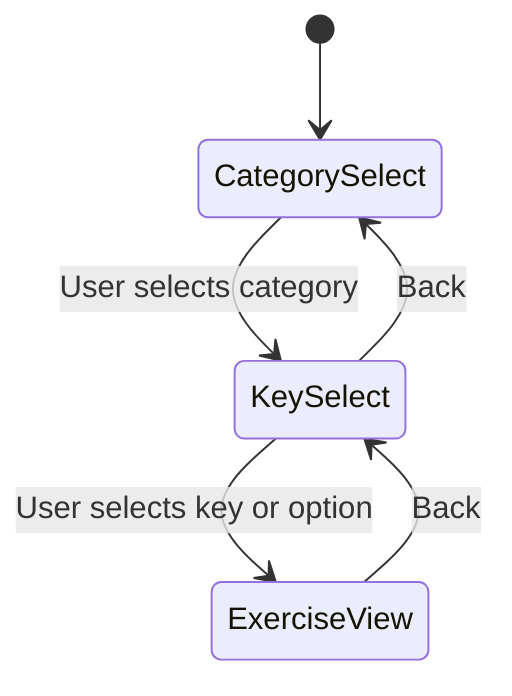

# Screen Flow

State machine view of screen transitions and the navigation stack.

## Diagram



## States

| State | Screen |
|-------|--------|
| CategorySelect | Category selection (Held Notes, Scales, Arpeggios, Chromatic Scales, Etudes) |
| KeySelect | Key or option selection (varies by category) |
| ExerciseView | Exercise display with rendered music, note names, fingerings, Play button, and clickable notes |

## Transitions

| From | To | Trigger |
|------|-----|---------|
| CategorySelect | KeySelect | User selects a category |
| KeySelect | ExerciseView | User selects a key or option |
| KeySelect | CategorySelect | User clicks Back |
| ExerciseView | KeySelect | User clicks Back |

## Navigation Stack

Back always pops the current screen and shows the previous one:

```
[CategorySelect]           → initial
[CategorySelect, KeySelect] → after category selection
[CategorySelect, KeySelect, ExerciseView] → after key/option selection
```
