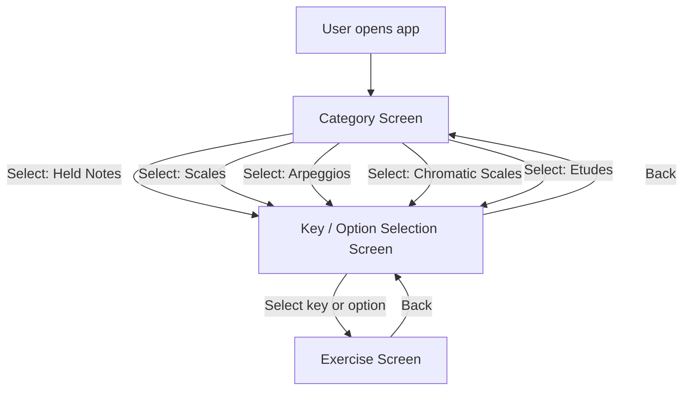

# User Flow

High-level flow of the user through the Trumpet Exercise App.

## Diagram

## Steps

1. **Category Screen** – User sees categories (Held Notes, Scales, Arpeggios, Chromatic Scales, Etudes) and selects one.
2. **Key/Option Selection Screen** – User sees keys or options based on category (e.g., major/minor keys for scales, chromatic ranges, etudes).
3. **Exercise Screen** – User sees the rendered music with note names and fingerings; can play the full exercise or click individual notes.

## Navigation

- **Back** – Available on Key Selection and Exercise screens; returns to the previous screen.
- **Select** – Moves forward to the next screen in the flow.
- **Play** – On Exercise screen, plays the full exercise with synthesized trumpet sound.
